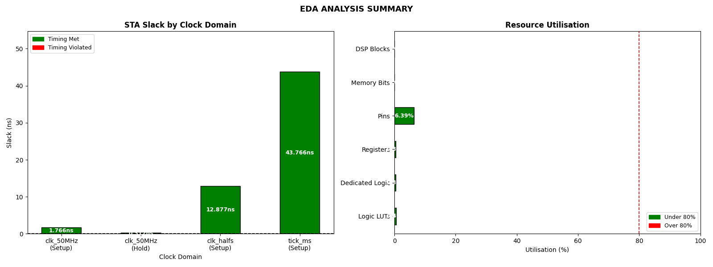

# EDA Analyser — Quartus STA & Synthesis Automation Tool

A Python tool that automates the parsing of Quartus Prime Static Timing Analysis (STA) and synthesis reports, developed as part of my FPGA coursework at Imperial College London.

---

## What It Does

### STA Analysis
- Parses any Quartus `.rpt` timing report automatically
- Extracts slack values across all clock domains
- Identifies Setup and Hold slack separately
- Calculates **WNS** (Worst Negative Slack) and **TNS** (Total Negative Slack)
- Flags timing violations in red

### Synthesis Analysis
- Parses Quartus synthesis reports
- Extracts resource utilisation (Logic LUTs, Registers, Pins, DSP Blocks, Memory Bits)
- Calculates utilisation percentage per resource
- Flags resources exceeding 80% utilisation threshold

### Outputs
- **Terminal summary** — formatted STA and synthesis tables
- **Two-panel chart** — STA slack + resource utilisation with colour-coded pass/fail indicators
- **Text report** — auto-saved `eda_summary.txt`
- **PNG chart** — auto-saved `eda_summary.png`

---

## Context

Built to complement my **F1 Reaction Timer FPGA project** — a 13-state Moore FSM with 6-bit LFSR random delay generation, synthesised in Quartus Prime on an Intel MAX10 FPGA with three clock domains (`clk_50MHz`, `clk_halfs`, `tick_ms`).
The tool is designed to be **generic** — it works on any Quartus timing or synthesis report, not just this project.

---

## Tools & Libraries

| Tool | Purpose |
|---|---|
| Python 3.11 | Core language |
| `re` | Regex-based report parsing |
| `matplotlib` | Two-panel chart generation |
| Quartus Prime | FPGA synthesis & STA (Intel MAX10) |

---

## How to Run

### Install dependencies
```bash
pip install matplotlib
